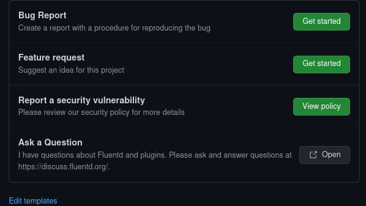
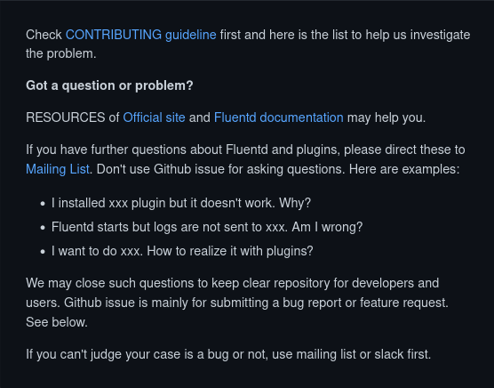
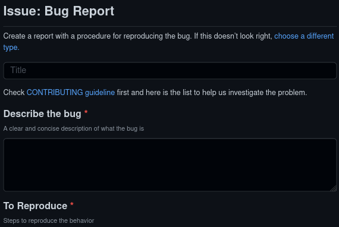

# OSSを継続的に\\nメンテナンスしていく\\n仕組みづくり

subtitle
:  Fluentdの事例とその最新情報

author
:  Kentaro Hayashi

content-source
:  OSC2022 Online/Spring

allotted-time
:  20m

theme
:  .

# 今日お話すること

* OSS(Fluentd)を継続的にメンテナンスしていく仕組みづくり
  * リリースするための仕組みを改善したこと
  * よいフィードバックをもらうために工夫したこと
  * プラグインを引き取る仕組みがあること

# Fluentdとは

{:relative-height="90"}

{::note}https://docs.fluentd.org/quickstart{:/note}

# 最新のリリース

* v1.14.5 (2022/02/09)
  * `in_http`で`application/x-ndjson`をサポート
  * `out_forward`がハングする不具合修正

# 定期的にリリース

* Fluentd
  * おおよそ2ヶ月ごとにメンテナンスリリース
  * 修正をはやくユーザーに届ける
    * masterではなおってます、というのを少なく

# リリース作業

* Fluentd gemの公開
* ブログ記事公開
  * {::note}https://www.fluentd.org/blog/{:/note}
* Dockerイメージの公開
* TD Agentの公開(随時)

# 最新パッケージ版

* TD Agent 4.3.0 (2021-12-13)
  * Fluentd+プラグイン集
  * 各種プラットフォーム向け(deb,rpm,msiなど)
  * おおよそ4ヶ月ごとリリース
* Calyptia Fluentd

# 従来のパッケージの課題

* パッケージを簡単につくれる・維持できる仕組みが必要

# TD Agent v3

* Omnibusベースのビルドシステム
  * 環境を整えるまでが大変
  * 特定の人だけがビルドできる状態

# TD Agent v4

* fluent-package-builder
  * Dockerベースのビルドに刷新
  * arm64のサポート
  * GitHub ActionsによるCI

{::note}https://github.com/fluent/fluent-package-builder{:/note}

# 今日お話すること

* Fluentdを継続的にメンテナンスしたい
  * ~~リリースするための仕組みを改善したこと~~
  * よいフィードバックをもらうために工夫したこと
  * プラグインを引き取るしくみがあること

# コミュニティーサポート

* GitHub Issues
  * {::note}https://github.com/fluent/fluentd/issues{:/note}
* Discource
  * {::note}https://discuss.fluentd.org/{:/note}
  * GitHub Discussionsへ移行
    * {::note}https://github.com/fluent/fluentd/discussions{:/note}
* Slack 
  {::note}https://fluent-all.slack.com/{:/note}

# よいフィードバックをもらうために工夫したこと

* GitHubのissueの役割をしぼる
  * 不具合報告 or 機能の要望のみにする
  * 単なる使い方の質問のissueで埋もれない
  * プラグインに関するissueに埋もれない

# 使い方を知りたい人向け

* GitHubのissueからdiscuss(Discource)への誘導
  * 課題: 開発者以外で回答する人が不足😞

{::note}https://discuss.fluentd.org/{:/note}

# issueを作成するときに示す

{::note}https://github.com/fluent/fluentd/issues/new/choose{:/note}

# よいフィードバックをもらうために工夫したこと

* それなりの規模のソフトウェアでありがちなこと
  * 背景もばらばらな人がフィードバックしてくれる
  * フィードバックで提供してもらえる内容がまちまち
  * 再現に必要な情報が不足している

# 従来のissueテンプレート

# 従来のissueテンプレート

* 入力項目が別れていない
* 必須項目を指定できない
* テンプレートを消して報告してくる強者も

# Issue formsの整備

* バグの内容
* 動作環境
* 再現方法
* 期待する挙動
* エラーログ
* 設定内容

# Issue formsを活用

{::note}https://github.com/fluent/fluentd/issues/new?assignees=&labels=&template=bug_report.yaml{:/note}

# Issueのメンテナンス

* 反応がないIssueというのもある
  * 放置されたIssueは閉じる

{::note}https://github.com/actions/stale{:/note}

# 工夫したことまとめ

* Issueの役割を明確にする(不具合・要望)
* Issue Formsで必要な情報を集める
* 古いIssueをGitHub Actionsで閉じる

# 今日お話すること

* Fluentdを継続的にメンテナンスしたい
  * ~~リリースするための仕組みを改善したこと~~
  * ~~よいフィードバックをもらうために工夫したこと~~
  * プラグインを引き取るしくみがあること

# Fluentdとプラグイン

* 多くの3rdパーティープラグインがある
* なかにはメンテナンスを継続できないケースも

{::note}https://www.fluentd.org/plugins{:/note}

# fluent-plugins-nursery

* メンテナンスを継続するためのプロジェクト
* リポジトリを移行してメンテナンスを継続
* もちろん配下で開発し続けてもよい

{::note}https://github.com/fluent-plugins-nursery/{:/note}

# メンテナンスを移行するには

* contactリポジトリを用意
* issueでownershipの移転のための手続きを実施

{::note}https://github.com/fluent-plugins-nursery/contact{:/note}

# よりオープンな開発方針

* GitHub Project
  * 実験的にプロジェクトメンバーで採用
  * 次のバージョンに入れるものとかを相談

{::note}https://github.com/orgs/fluent/projects/4{:/note}

# さいごに

* フィードバックを歓迎しています
  * バグに遭遇したらGitHubのIssueとして報告する
  * 既存のissueにコメントする(助け合いの精神で！)
* 開発に関しては次の発表で！
